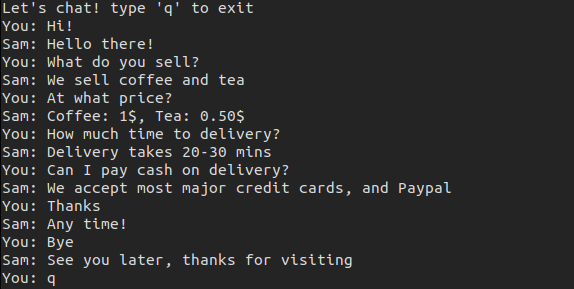

- This is a simple chatbot in pytorch for a coffee and tea shop.
- Uses NLP techniques, So that questions can be asked differently.
- You can use it for other applications also, just modify json file.

> Main work: This simply identifies the tag of a question, uses only two hidden layers and train on very little data.

Take a look:

## For your system:

- Requirements:
    - Pytorch
    - nltk
- Check intents.json file add whatever you want.
- Run train.py to train the model.
- Run chat.py and start chat.
